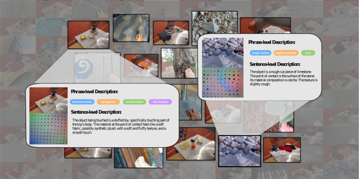

# Touch100k

🚀🚀🚀 The implementation of **Touch100k: A Large-Scale Touch-Language-Vision Dataset for Touch-Centric Multimodal Representation**.

  

## ❤️ Acknowledgement
* [LanguageBind](https://github.com/PKU-YuanGroup/LanguageBind): An open source, language-based multimodal pre-training framework. Thanks for their wonderful work.
* [OpenCLIP](https://github.com/mlfoundations/open_clip): An amazing open-sourced backbone.

## 🔒 License
 This project is under the MIT license.

 The dataset is CC BY NC 4.0 (allowing only non-commercial use) and models trained using the dataset should not be used outside of research purposes.