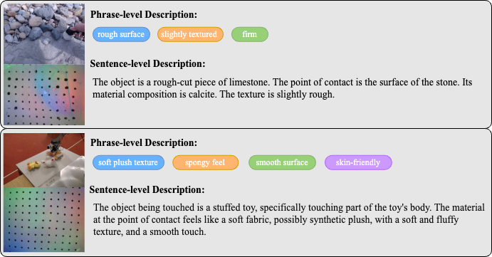

# Touch100k

  

## ❤️ Acknowledgement
* [LanguageBind](https://github.com/PKU-YuanGroup/LanguageBind): An open source, language-based multimodal pre-training framework. Thanks for their wonderful work.
* [OpenCLIP](https://github.com/mlfoundations/open_clip): An amazing open-sourced backbone.
